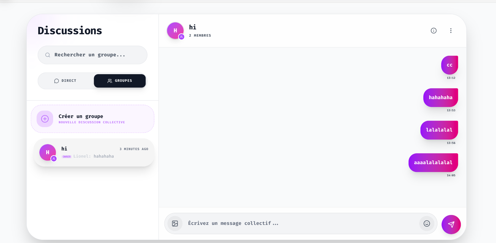
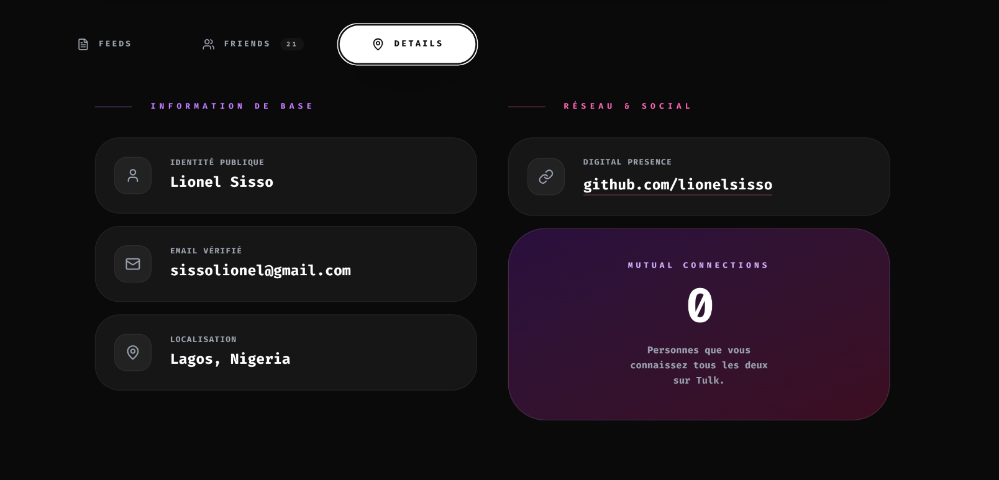

<div align="center">

*Read this in other languages: [English](README.md), [Français](README.fr.md)*

# 🌐 Tulk - The Next-Gen Premium Social Platform

<p align="center">
  
  
  
  
</p>

**Experience a social network reimagined. Tulk combines a stunning glassmorphic UI with robust real-time backend capabilities to deliver a fluid, inclusive, and highly premium user experience.**

### 🚀 [**LIVE DEMO: tulk-phi.vercel.app**](https://tulk-phi.vercel.app)

</div>

---

## 📖 Table of Contents
- [🌟 Overview](#-overview)
- [✨ Key Features](#-key-features)
- [🖼️ Application Gallery](#-application-gallery)
- [🛠️ Tech Stack & Architecture](#-tech-stack--architecture)
- [🚀 Local Setup & Installation](#-local-setup--installation)
- [📡 API & Data Flow](#-api--data-flow)
- [🤝 Contact & Credits](#-contact--credits)

---

## 🌟 Overview
**Tulk** is a modern, responsive, and highly secure social platform designed for the new generation. Built entirely from the ground up, it features an advanced hybrid architecture separating a lightning-fast static frontend (React edge-deployed on Vercel) from a powerful stateless backend API (Laravel hosted on Alwaysdata).

Our mission is to foster an enriching, interactive digital environment where connecting with friends, sharing moments, and networking feels natural and visually spectacular.

---

## ✨ Key Features

### 🎨 Premium Glassmorphic Design UI/UX
- **Dynamic Theming:** Seamless transition between Light and Dark mode using a custom variable-based CSS architecture.
- **Glassmorphism:** Elegant blurred containers, subtle glowing borders, and stunning gradient backdrops.
- **Micro-interactions:** Delightful animations implemented via pure CSS and Lucide React icons.

### 💬 Real-Time Chat & Groups
- **Group Chats:** Create dynamic groups, invite mutual friends, and share images seamlessly.
- **Private Messaging:** Encrypted one-on-one direct messages.
- **Quick Profiles:** Click on any user's avatar within a chat to view a quick summary modal without losing your current context.

### 📱 Infinite Feed & Social Engagement
- **Dynamic Newsfeed:** Infinite scrolling feed with real-time interactions.
- **Rich Media & Contexts:** Support for text, hashtags, and high-quality image uploads up to 5MB.
- **Nested Discussions:** Multi-layered commenting system providing structured and threaded replies.

### 👥 Advanced Network Management
- **Friend Requests:** Robust 2-way friendship validations.
- **Follow System:** A one-way subscription model to stay updated on favorite content creators.
- **Suggestions:** An intelligent mutually-based suggestion algorithm to discover people you might know.

### 🔒 Enterprise-Grade Security
- **Authentication:** Token-based authentication using Laravel Sanctum with enforced expiration.
- **Anti-Spam:** Advanced Rate Limiting across all critical endpoints.
- **Password Resilience:** Secure encryption using Argon2/Bcrypt and email-verified recovery workflows.

---

## 🖼️ Application Gallery

Here is a glimpse of **Tulk**'s stunning interfaces:

<div align="center">

| 📱 Home Feed | 👤 Profile Overview |
|:---:|:---:|
|  |  |
| *Immersive content discovery* | *Detailed personal dashboard* |

| 💬 Group Discussions & Chat | 🔍 Deep Profile Insights |
|:---:|:---:|
|  |  |
| *Rich embedded media & Quick Profiles* | *Follower analytics and mutual friends* |

</div>

---

## 🛠️ Tech Stack & Architecture

Tulk relies on a strict separation of concerns, heavily utilizing APIs to keep the client completely decoupled from the data layer.

### ⚛️ Frontend (Client-Side)
- **Framework:** React 18
- **Build Tool:** Vite 5 for instant HMR
- **Styling:** TailwindCSS 3 (Utility-first) + Vanilla CSS Variables (Theming)
- **Routing:** React Router v6
- **Hosting:** Vercel Edge Network

### 🐘 Backend (Server-Side)
- **Framework:** Laravel 10.x
- **Language:** PHP 8.2
- **Database:** MySQL 8.0 (Schema optimized with foreign keys & cascading deletions)
- **Auth:** Laravel Sanctum (Stateful & Token-based)
- **Hosting:** Alwaysdata

---

## 🚀 Local Setup & Installation

Want to run **Tulk** locally? Follow these simple steps.

### Prerequisites
- PHP >= 8.2 & Composer
- Node.js >= 18.x
- MySQL >= 8.0

### 1. Clone the repository
```bash
git clone https://github.com/votre-username/tulk.git
cd tulk
```

### 2. Backend Initialization
```bash
cd back
composer install
cp .env.example .env
php artisan key:generate

# Adjust your .env to target your local MySQL credentials before migrating!
php artisan migrate --seed
php artisan storage:link

php artisan serve --port 8000
```

### 3. Frontend Initialization
```bash
cd ../front
npm install
cp .env.example .env

# Make sure VITE_API_URL=http://localhost:8000/api in your .env
npm run dev
```

### 💡 Sandbox Test Account
You can test the application locally using the pre-seeded account:
- **Email:** `sissolionel@gmail.com`
- **Password:** `sisso2026` *(or verify in your seed files)*

---

## 📡 API & Data Flow

Tulk features over 40 distinct, heavily secured RESTful endpoints spanning multi-resource validations. 

- **Statefulness:** The API communicates state validation via custom HTTP Response Codes (`403 Forbidden`, `401 Unauthorized`, `404 Not Found`).
- **Pagination:** Feed queries load minimal slices of database nodes, heavily reducing RAM usage and speeding response times.
- **CORS Management:** Strict Cross-Origin configurations allow only specific deployments to execute mutable operations.

---

## 🤝 Contact & Credits

**Architect & Lead Developer:** Lionel Sisso  
**Email:** sissolionel@gmail.com  
**GitHub:** [@lionelsisso](https://github.com/lionelsisso)

<div align="center">
<br/>

**Built with passion and dedication to clean code.** 💜

*© 2026 Tulk Inc. All rights reserved.*
</div>
