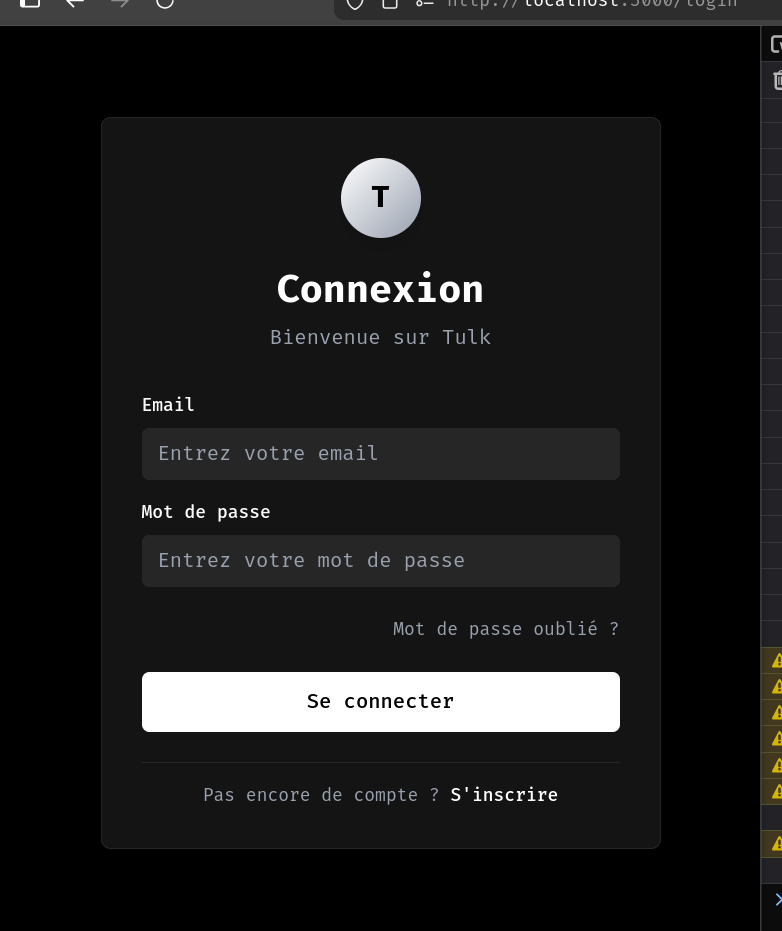
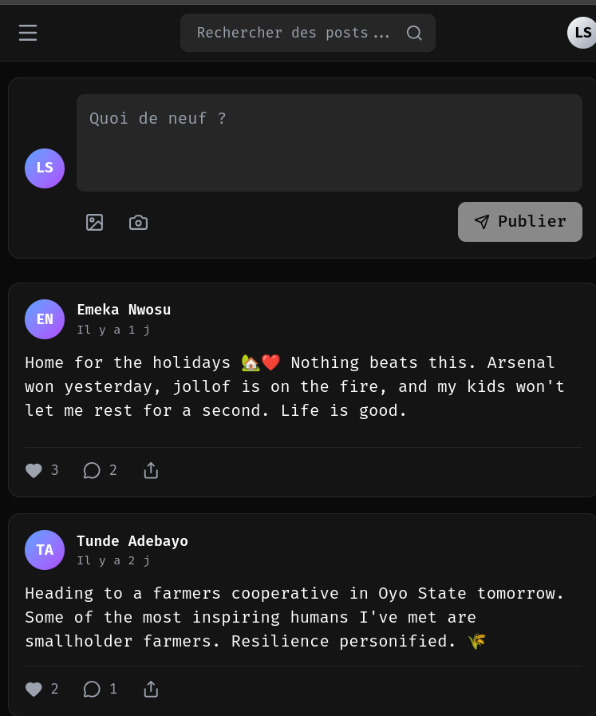
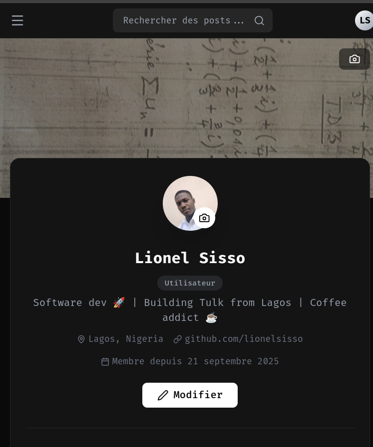

# 🌐 Tulk - Plateforme Sociale Moderne

<div align="center">


**Une expérience sociale repensée pour la nouvelle génération**

[](https://laravel.com)
[](https://reactjs.org)
[](https://mysql.com)
[](https://tailwindcss.com)

</div>

---

## 📖 Table des Matières

- [🌟 Aperçu](#-aperçu)
- [✨ Fonctionnalités](#-fonctionnalités)
- [🖼️ Galerie](#-galerie)
- [🛠️ Stack Technique](#-stack-technique)
- [🚀 Installation](#-installation)
- [📁 Structure du Projet](#-structure-du-projet)
- [🔐 Authentification](#-authentification)
- [📊 Base de Données](#-base-de-données)
- [🤝 Collaborateurs](#-collaborateurs)
- [📝 Licence](#-licence)

---

## 🌟 Aperçu

**Tulk** est une plateforme sociale moderne conçue pour connecter les utilisateurs de manière authentique et significative. Développée avec les dernières technologies web, l'application offre une expérience utilisateur fluide, responsive et sécurisée.

Notre mission est de créer un espace numérique où les interactions sociales sont enrichissantes, respectueuses et centrées sur l'utilisateur.

---

## ✨ Fonctionnalités

### 🔐 Authentification & Sécurité
- ✅ Inscription multi-étapes avec vérification email
- ✅ Connexion sécurisée avec tokens JWT (Laravel Sanctum)
- ✅ Protection contre les attaques par force brute (rate limiting)
- ✅ Gestion de session token-based
- ✅ Réinitialisation de mot de passe

### 📱 Fil d'Actualité
- ✅ Création de posts avec texte et images (max 5MB)
- ✅ Système de likes avec compteur en temps réel
- ✅ Commentaires nested avec réponses
- ✅ Suppression de posts (propriétaire uniquement)
- ✅ Formatage intelligent des dates (il y a 5 min, il y a 2h...)

### 👥 Système d'Amis
- ✅ Envoi de demandes d'amitié
- ✅ Acceptation/Refus de demandes
- ✅ Suggestions d'amis basées sur les amis mutuels
- ✅ Recherche d'utilisateurs
- ✅ Suppression d'amis
- ✅ Statut des relations (ami, en attente, non connecté)

### 👤 Profils Utilisateurs
- ✅ Photo de profil personnalisable
- ✅ Bannière de profil
- ✅ Bio, localisation, site web
- ✅ Statistiques (posts, amis, followers, likes)
- ✅ Like de profil
- ✅ Système de follow/unfollow
- ✅ Affichage des publications de l'utilisateur

### 🔔 Notifications
- ✅ Notifications en temps réel
- ✅ Types multiples (likes, commentaires, amis, mentions)
- ✅ Marquer comme lu/tout lire
- ✅ Suppression de notifications
- ✅ Filtres (toutes, non lues, lues)
- ✅ Compteur de notifications non lues

### 🔍 Recherche
- ✅ Recherche d'utilisateurs par nom, prénom, email
- ✅ Affichage des amis mutuels
- ✅ Actions rapides (ajouter, liker, suivre)
- ✅ Debounce pour optimiser les requêtes

### 🎨 Interface Utilisateur
- ✅ Thème sombre élégant
- ✅ Design responsive (mobile, tablette, desktop)
- ✅ Animations fluides
- ✅ Menu latéral navigable
- ✅ Dropdown de profil
- ✅ Modales de confirmation

---

## 🖼️ Galerie

<div align="center">

### 📸 Aperçu de l'Application

<table align="center" style="width:100%; max-width:1000px; margin: 0 auto;">
  <tr>
    <td align="center" style="padding: 10px; width: 50%;">
      <br>
      <em style="color: #9ca3af; font-size: 0.9rem;">🔐 Interface de connexion sécurisée</em>
    </td>
    <td align="center" style="padding: 10px; width: 50%;">
      <br>
      <em style="color: #9ca3af; font-size: 0.9rem;">📱 Fil d'actualité avec posts et interactions</em>
    </td>
  </tr>
  <tr>
    <td align="center" colspan="2" style="padding: 10px;">
      <br>
      <em style="color: #9ca3af; font-size: 0.9rem;">👤 Page de profil avec statistiques et publications</em>
    </td>
  </tr>
</table>

</div>

---

## 🛠️ Stack Technique

### Frontend
| Technologie | Version | Description |
|------------|---------|-------------|
| React | 18.x | Bibliothèque UI |
| Vite | 5.x | Build tool rapide |
| TailwindCSS | 3.x | Framework CSS utilitaire |
| React Router | 6.x | Navigation SPA |
| Axios | 1.x | Client HTTP |
| Lucide React | Latest | Bibliothèque d'icônes |

### Backend
| Technologie | Version | Description |
|------------|---------|-------------|
| Laravel | 10.x | Framework PHP |
| Laravel Sanctum | 3.x | Authentification API |
| MySQL | 8.0 | Base de données |
| PHP | 8.2+ | Langage serveur |

### Outils & Services
| Outil | Usage |
|-------|-------|
| Git | Contrôle de version |
| Composer | Gestion de dépendances PHP |
| npm/yarn | Gestion de dépendances JS |
| SMTP (Gmail) | Envoi d'emails |

---

## 🚀 Installation

### Prérequis
```bash
- PHP 8.2 ou supérieur
- Composer 2.x
- Node.js 18.x ou supérieur
- MySQL 8.0 ou supérieur
- Git
```

### 1. Cloner le Repository
```bash
git clone https://github.com/votre-username/tulk.git
cd tulk
```

### 2. Configuration Backend (Laravel)
```bash
cd back

# Installer les dépendances PHP
composer install

# Copier le fichier d'environnement
cp .env.example .env

# Générer la clé d'application
php artisan key:generate

# Configurer la base de données dans .env
# DB_DATABASE=Tulk
# DB_USERNAME=votre_user
# DB_PASSWORD=votre_mot_de_passe

# Exécuter les migrations
php artisan migrate

# Seeder la base de données (optionnel - données de test)
php artisan db:seed

# Créer le lien symbolique pour les images
php artisan storage:link

# Démarrer le serveur Laravel
php artisan serve
```

### 3. Configuration Frontend (React)
```bash
cd front

# Installer les dépendances Node
npm install

# Copier le fichier d'environnement
cp .env.example .env

# Configurer l'URL de l'API dans .env
# VITE_API_URL=http://localhost:8000/api

# Démarrer le serveur de développement
npm run dev
```

### 4. Accéder à l'Application
```
Frontend: http://localhost:3000
Backend API: http://localhost:8000/api
```

### 5. Compte de Test (après seeding)
```
Email: sissolionel@gmail.com
Mot de passe: sisso2026
```

---

## 📁 Structure du Projet

```
tulk/
├── back/                          # Backend Laravel
│   ├── app/
│   │   ├── Http/
│   │   │   ├── Controllers/       # Contrôleurs API
│   │   │   └── Middleware/        # Middleware personnalisé
│   │   ├── Models/                # Modèles Eloquent
│   │   ├── Mail/                  # Templates d'emails
│   │   └── Services/              # Services métier
│   ├── database/
│   │   ├── migrations/            # Migrations DB
│   │   └── seeders/               # Seeders de données
│   ├── resources/
│   │   ├── views/emails/          # Templates email HTML
│   │   └── js/                    # Assets JS (optionnel)
│   ├── routes/
│   │   └── api.php                # Routes API
│   └── .env                       # Configuration environnement
│
├── front/                         # Frontend React
│   ├── src/
│   │   ├── components/            # Composants React
│   │   │   ├── auth/              # Login, Signup
│   │   │   ├── main/              # Home, Profile, etc.
│   │   │   └── Modal.jsx          # Composant modal réutilisable
│   │   ├── contexts/              # Contextes React (Auth)
│   │   ├── utils/                 # Utilitaires (API, images)
│   │   ├── style/                 # Styles globaux
│   │   └── App.jsx                # Composant principal
│   ├── .env                       # Configuration environnement
│   └── vite.config.js             # Configuration Vite
│
└── README.md                      # Ce fichier
```

---

## 🔐 Authentification

### Flux d'Inscription
```
1. Saisie des informations (nom, email)
2. Création du mot de passe
3. Upload photo de profil (optionnel)
4. Vérification email (code 6 chiffres)
5. Création du compte
6. Redirection vers la page de connexion
```

### Flux de Connexion
```
1. Saisie email + mot de passe
2. Validation des credentials
3. Génération token Sanctum
4. Stockage token + user data dans localStorage
5. Redirection vers le fil d'actualité
```

### Sécurité
- Tokens JWT avec expiration
- Rate limiting sur les tentatives de connexion (5/min)
- Hachage des mots de passe avec bcrypt
- Protection CSRF désactivée pour API (tokens utilisés)
- Validation des inputs côté serveur

---

## 📊 Base de Données

### Tables Principales

| Table | Description |
|-------|-------------|
| `Utilisateur` | Utilisateurs inscrits |
| `Article` | Publications/posts |
| `Commentaire` | Commentaires sur les posts |
| `Amitie` | Relations d'amitié |
| `Liker` | Likes sur les posts |
| `Follow` | Relations follow/unfollow |
| `ProfileLike` | Likes sur les profils |
| `Notification` | Notifications utilisateur |
| `Message` | Messages privés |
| `personal_access_tokens` | Tokens Sanctum |

### Relations Clés
```
Utilisateur (1) ── (N) Article
Utilisateur (1) ── (N) Commentaire
Utilisateur (N) ── (N) Amitie (table pivot)
Utilisateur (1) ── (N) Liker
Utilisateur (1) ── (N) Follow
Utilisateur (1) ── (N) Notification
```

---

## 📡 API Endpoints

### Authentification
| Méthode | Endpoint | Description |
|---------|----------|-------------|
| POST | `/api/login` | Connexion utilisateur |
| POST | `/api/register` | Inscription |
| POST | `/api/logout` | Déconnexion |
| POST | `/api/send-verification` | Envoyer code vérification |
| POST | `/api/verify-code` | Vérifier code |

### Posts
| Méthode | Endpoint | Description |
|---------|----------|-------------|
| GET | `/api/posts/feed` | Récupérer le fil |
| POST | `/api/posts` | Créer un post |
| DELETE | `/api/posts/{id}` | Supprimer un post |
| POST | `/api/posts/{id}/like` | Liker/unliker |
| GET | `/api/posts/{id}/comments` | Voir commentaires |
| POST | `/api/posts/{id}/comments` | Ajouter commentaire |

### Amis
| Méthode | Endpoint | Description |
|---------|----------|-------------|
| GET | `/api/friends` | Liste d'amis |
| GET | `/api/friends/suggestions` | Suggestions |
| GET | `/api/friends/pending` | Demandes en attente |
| GET | `/api/friends/search` | Recherche utilisateurs |
| POST | `/api/friends/request` | Envoyer demande |
| POST | `/api/friends/accept` | Accepter demande |
| POST | `/api/friends/remove` | Supprimer ami |

### Profil
| Méthode | Endpoint | Description |
|---------|----------|-------------|
| GET | `/api/profile/{id}` | Voir profil |
| PUT | `/api/profile` | Modifier profil |
| POST | `/api/profile/image` | Upload avatar |
| POST | `/api/profile/banner` | Upload bannière |
| POST | `/api/profile/{id}/like` | Liker profil |
| POST | `/api/profile/{id}/follow` | Suivre utilisateur |
| DELETE | `/api/profile/{id}/follow` | Ne plus suivre |

### Notifications
| Méthode | Endpoint | Description |
|---------|----------|-------------|
| GET | `/api/notifications` | Liste notifications |
| GET | `/api/notifications/unread-count` | Compteur non lues |
| POST | `/api/notifications/{id}/read` | Marquer comme lu |
| POST | `/api/notifications/read-all` | Tout marquer lu |
| DELETE | `/api/notifications/{id}` | Supprimer notification |
| DELETE | `/api/notifications/all` | Tout supprimer |

---

## 🤝 Collaborateurs

<div align="center">

| | |
|---|---|
| **Développeur Principal** | Lionel Sisso |
| **Email** | sissolionel@gmail.com |
| **GitHub** | [@lionelsisso](https://github.com/lionelsisso) |

</div>

---

## 📝 Licence

Ce projet est propriétaire et tous droits sont réservés.

```
© 2025 Tulk. Tous droits réservés.
```

---

## 📞 Contact

Pour toute question ou suggestion, n'hésitez pas à contacter l'équipe de développement :

- **Email:** sissolionel@gmail.com
- **Projet:** Tulk - Plateforme Sociale

---

<div align="center">

**Développé avec ❤️ en utilisant Laravel & React**


</div>